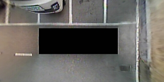
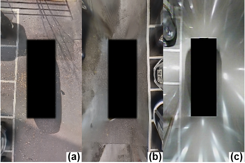

# AVM (Around View Monitoring) System Datasets for Auto Parking

## Abstract

We present the AVM System Datasets for auto parking. The datasets consists of two different categories. One aims for training of semantic segmentation to understand surrounding environments by using only AVM images. The other aims for performance evaluation of parking space detection. We hope that through these datasets, many researchers will suggest creative algorithms and improve recognition performance.

The implementation code of semantic segmentation for AVM is available in this [link](https://github.com/ChulhoonJang/avm_ss)

## Description of *SS*(Semantic Segmentation) dataset

This dataset contains 6763 camera images at a resolution of 320 x 160 pixels. There are four categories: free space, marker, vehicle, and other objects. For each image, a corresponding ground truth image is composed of four color annotations to distinguish different classes.

dataset name: *avm_seg_db* ([download](http://log.acelab.org:5000/sharing/XZzWpdwnA))

**Total number of semantic segmentation images of AVM: 6763**

**outdoor** images: 3614

| Condition | Slot Type | Parking Space Type | Number of Parking spaces |
| --------- | --------- | -------------------| ------------------------ |
| Outdoor   | Closed    | Perpendicular      | 2005                     |
| Outdoor   | Opened    | Perpendicular      | 674  |
| Outdoor   | No marker | Perpendicular      | 19   |
| Outdoor   | Closed    | Parallel           | 686  |
| Outdoor   | Opened    | Parallel           | 0    |
| Outdoor   | No marker | Parallel           | 230  |

**indoor** images: 3149

| Condition | Slot Type | Parking Space Type | Number of Parking spaces |
| --------- | --------- | -------------------| ------------------------ |
| Indoor    | Closed    | Perpendicular      | 2642 |
| Indoor    | Opened    | Perpendicular      | 0    |
| Indoor    | No marker | Perpendicular      | 340  |
| Indoor    | Closed    | Parallel           | 67   |
| Indoor    | Opened    | Parallel           | 0    |
| Indoor    | No marker | Parallel           | 100  |

| Category  | Frames   |
| --------- | -------- |
| Training  | 4057     |
| Test      | 2706     |
| **Total** | **6763** |

* class 0: Free space *- RGB color [0, 0, 255]*
* class 1: Marker *- RGB color [255,255,255]*
* class 2: Vehicle *- RGB color [255,0,0]*
* class 3: Other objects (curb, pillar, wall, and so on) *- RGB color [0,255,0]*
* Negligible area: Ego vehicle *- RGB color [0,0,0]*

 

The SS dataset contains various samples from outdoor and indoor parking lots. In particular, the indoor samples are quite difficult to recognize because reflected lights look similar with slot markers and they might degrade slot marker detection.

​                                                       (a) outdoor-day, (b) outdoor-rainy, (c) indoor

## Description of *PS*(Parking Space) dataset

dataset name: *avm_ps_db* ([download](http://log.acelab.org:5000/sharing/OGsE9hjgv))

**Total number of parking spaces / Frames: 35889 / 21581**

Total number of parking spaces in **outdoor** condition: 13307

| Condition | Slot Type | Parking Space Type | Number of Parking spaces |
| --------- | --------- | -------------------| ------------------------ |
| Outdoor   | Closed    | Perpendicular      | 8277                     |
| Outdoor   | Opened    | Perpendicular      | 2627 |
| Outdoor   | Closed    | Parallel           | 1883 |
| Outdoor   | Opened    | Parallel           | 452  |
| Outdoor   | No marker | Parallel           | 68   |

Total number of parking spaces in **indoor** condition: 22582

| Condition | Slot Type | Parking Space Type | Number of Parking spaces |
| --------- | --------- | -------------------| ------------------------ |
| Indoor    | Closed    | Perpendicular      | 21734 |
| Indoor    | No marker | Perpendicular      | 848 |

